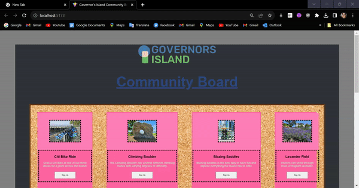

# Web Development Project 1 - Community-Board

Submitted by: Loyd Flores

This web app: "Developed a React-based webpage emulating Governor's Island community board featuring multiple boards catering to various event types, where each event is represented as a virtual sticky note, facilitating seamless event organization and management. The actual events exist within the Island's event programming."

Time spent: **6** hours spent in total

## Required Features

The following **required** functionality is completed:

- [✅] **There is a unique theme for events or resources relevant to a specific community**
- [✅] **At least 10 unique resources or events are displayed in a responsive card format**

## Video Walkthrough

Here's a walkthrough of implemented required features:

GIF created with 
1. Loom
2. Ezgif

## Notes

1. Learning the Basics of React: Getting acquainted with React can be a steep learning curve, especially for beginners, but it's a fundamental skill for building web applications with React.

2. Revisiting Vanilla CSS: Transitioning from more advanced CSS frameworks or preprocessors to vanilla CSS can be challenging, as it may require more manual styling and management of styles.

3. Git and Version Control: Git and version control can be complex, and mastering branching, merging, and resolving conflicts can be a challenge, particularly when working on a collaborative project.

4. Mobile Responsiveness: Ensuring that a website is mobile-responsive can be tricky, as it involves adjusting layouts and styles to work effectively on various screen sizes and devices. It's a common challenge in web development projects.

## License

    Copyright 2023 Loyd Flores

    Licensed under the Apache License, Version 2.0 (the "License");
    you may not use this file except in compliance with the License.
    You may obtain a copy of the License at

        http://www.apache.org/licenses/LICENSE-2.0

    Unless required by applicable law or agreed to in writing, software
    distributed under the License is distributed on an "AS IS" BASIS,
    WITHOUT WARRANTIES OR CONDITIONS OF ANY KIND, either express or implied.
    See the License for the specific language governing permissions and
    limitations under the License.
